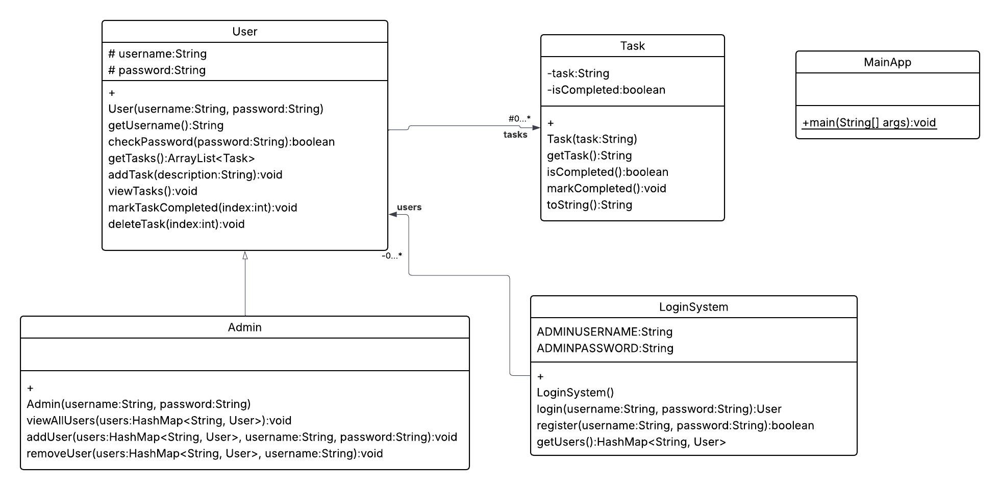

# Task Management System in Java

A simple console-based task management system built in Java that supports:

- User registration and login
- Admin functionality to manage users
- Task creation, completion, viewing, and deletion

---

## 💡 Features

### 👤 User
- Register a new account
- Login with username and password
- Add personal tasks
- View all personal tasks
- Mark tasks as completed
- Delete tasks

### 🔐 Admin (default: `admin` / `password123`)
- All User functionalities
- View all registered users
- Add new users manually
- Remove users (except admin)

---

## 🛠 Technologies Used
- Java (Standard Edition)
- Java Collections (e.g., HashMap, ArrayList)
- Console-based I/O with `Scanner`

---

## 🚀 How to Run

1. **Clone the repository** or download the `.java` files.
2. Compile the Java files:
   ```bash
   javac *.java

---

## 📊 UML Class Diagram


